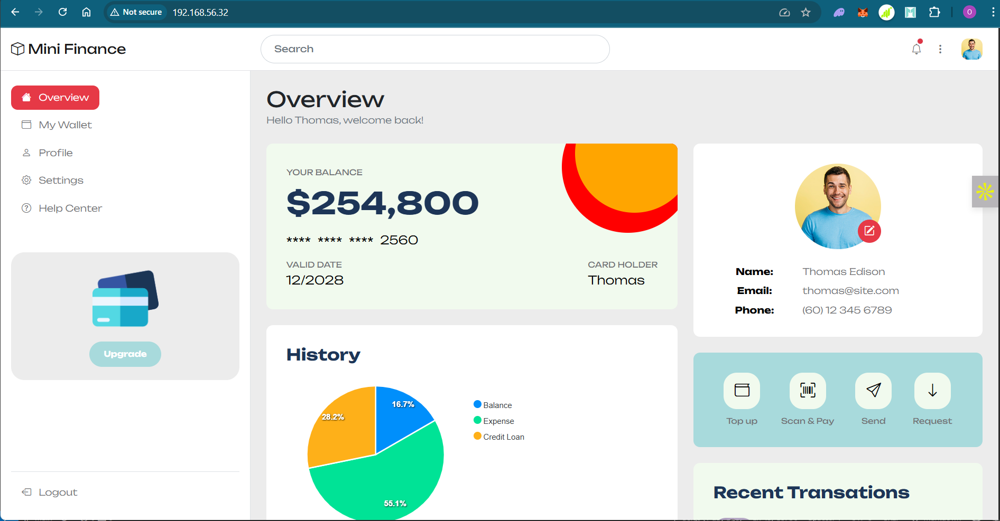

# Finance Website Deployment with Vagrant & Shell Provisioning

This project demonstrates a simple Infrastructure-as-Code (IaC) setup to deploy a static finance-themed website using **Vagrant** and **Shell scripting**. The goal is to automate the provisioning of a local development environment using a CentOS VM with Apache (`httpd`) and deploy a pre-designed template from [Tooplate](https://www.tooplate.com).

---

## Project Overview

-  **Tool Used:** Vagrant + Inline Shell Script
-  **Deployed Service:** Static finance website (HTML/CSS)
-  **Use Case:** Local testing of infrastructure automation with basic web deployment

---

##  How to Use

###  Prerequisites

- [Vagrant](https://www.vagrantup.com/downloads)
- [VirtualBox](https://www.virtualbox.org/) or any Vagrant-compatible provider

###  Setup Instructions

1. Clone the repository or navigate to this folder:

   ```bash
   git clone https://github.com/Osigah/My-Portfolio.git
   cd My-Portfolio/infrastructure-as-code/finance-website-vagrant
2. Start the VM and provision it:
    ```bash
    vagrant up
3. Access the Site
    ```bash
    Once provisioned, visit the ip mapped in the vagrant file
    You should see the Mini Finance static site loaded.
4. SSH into the VM if needed:
    ```bash
    vagrant ssh
    ip addr show - to get the ip address.
5. Destroy the VM when done
    ```bash
    vagrant destroy
---

## What Happens Behind the Scenes ?
1. script included in the Vagrant file :  
    ```bash
    config.vm.provision "shell", inline: <<-SHELL
    yum install httpd wget unzip vim -y
    systemctl start httpd
    systemctl enable httpd
    mkdir -p /tmp/finance
    cd /tmp/finance
    wget https://www.tooplate.com/zip-templates/2135_mini_finance.zip
    unzip -o 2135_mini_finance.zip
    cp  -r 2135_mini_finance/* /var/www/html/
    systemctl restart httpd
   SHELL
The provisioning script automatically:

1. Installs required packages (httpd, wget, unzip, vim)

2. Starts and enables the Apache web server

3. Downloads the Mini Finance HTML template

4. Extracts and copies files to /var/www/html/

5. Restarts the web server to serve the site

---
Image of site hosted locally as pulled from tooplate.



---
## Technologies Used
- Vagrant – Infrastructure automation and VM provisioning

- Shell Scripting – Inline provisioning of services and website

- Apache (httpd) – Web server

- CentOS – Base image for VM

---

##  Highlights
Hands-on introduction to IaC principles

Uses automated provisioning for consistent environments

Downloaded a live site and deployed it locally within seconds

Lays the foundation for future tools (Ansible, Docker, cloud infra)

---

## Future Improvements
Replace inline shell with provision.sh (external script file)

Switch provisioning to Ansible for better configuration control

Add port forwarding in Vagrantfile for easy browser access (host:8080 → guest:80)

Parameterize variables (template source, destination path)

Include a screenshot or GIF of the deployed site

Optionally migrate to Docker or Terraform + cloud hosting

---

## Author
Osigah
DevOps | Network Security | Automation | Cloud

---

## License
This project is provided for educational purposes and personal learning. All rights for the downloaded template belong to Tooplate.